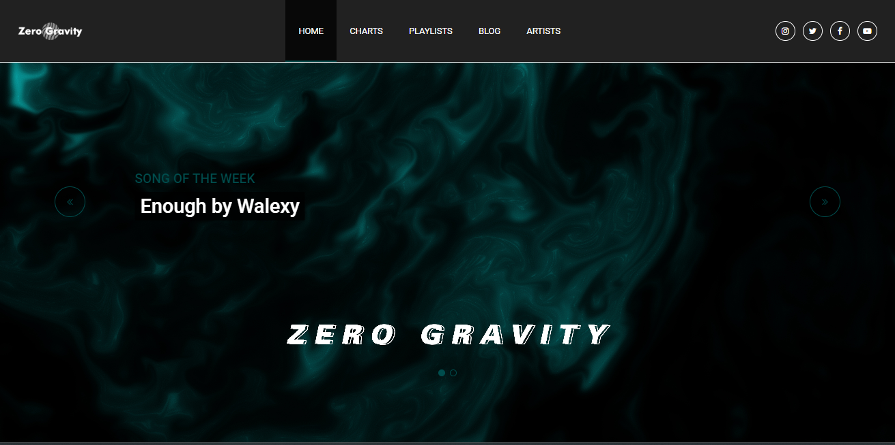
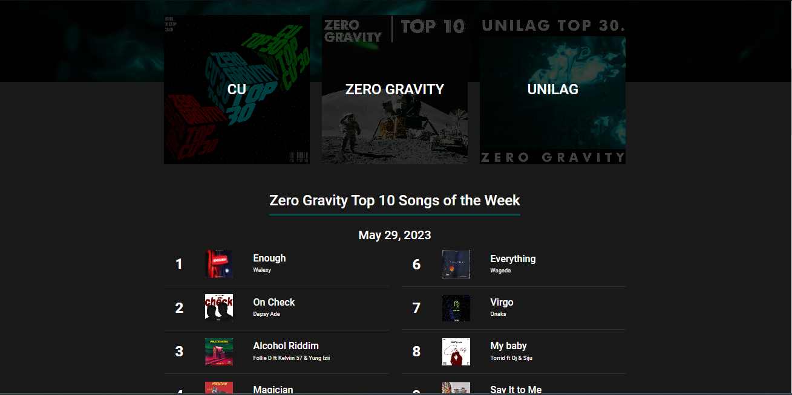
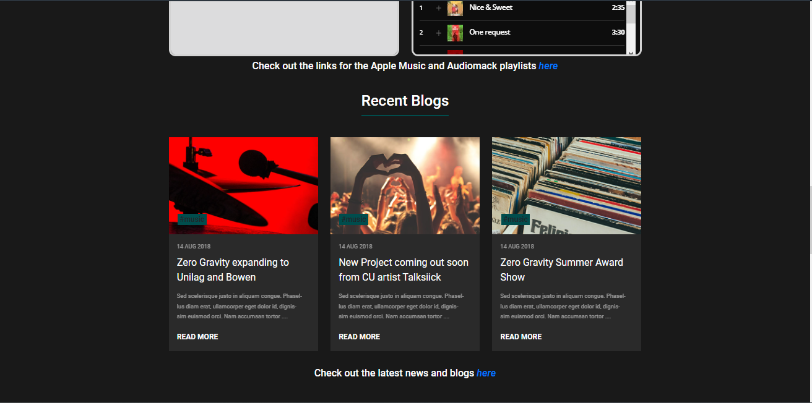
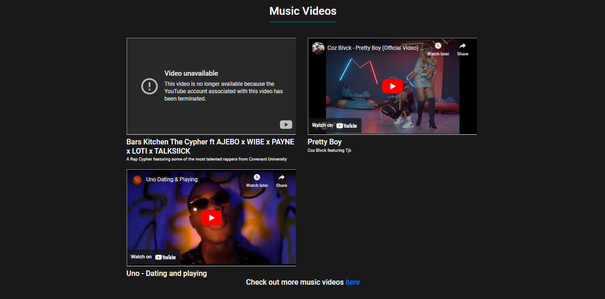

# Music Blog

 
 

<table>
  <tr>
    <td></td>
    <td></td>
  </tr>
  <tr>
    <td></td>
    <td></td>
  </tr>
</table>
 

 

<b>A music blog web app</b>

 

## ➡️ Description
This is a music blog web app built with html, css and python using the web development framework Flask. 
Built this app while learning Web development using python flask. 

## ➡️ Features
* Responsive and user-friendly frontend
* Song Charts
* Blog Cards
* Youtube Video Frames
  

## ➡️ Languages | Technologies
<table>
  <tr>
    <td>Programming Languages</td>
    <td>Python</td>
  </tr>
  <tr>
    <td>Backend</td>
    <td>Flask</td>
  </tr>
  <tr>
    <td>Frontend</td>
    <td>HTML, CSS, Bootstrap</td>
  </tr>
  <tr>
    <td>Database</td>
    <td>Sqlite3</td>
  </tr>
</table>
 

## ➡️ Installation
* Clone or download this repository
* Ensure python is installed on your system
* Create virtual environment in parent directory, run `python -m venv venv`
* Activate environment, for bash run `source venv/Scripts/activate`
* Install project packages, run `pip install -r requirements.txt`
* Navigate to main/ directory and run `python app.py`
 

## ➡️ Contribution/Improvement
* To improve on this, a page for blog detail should be created